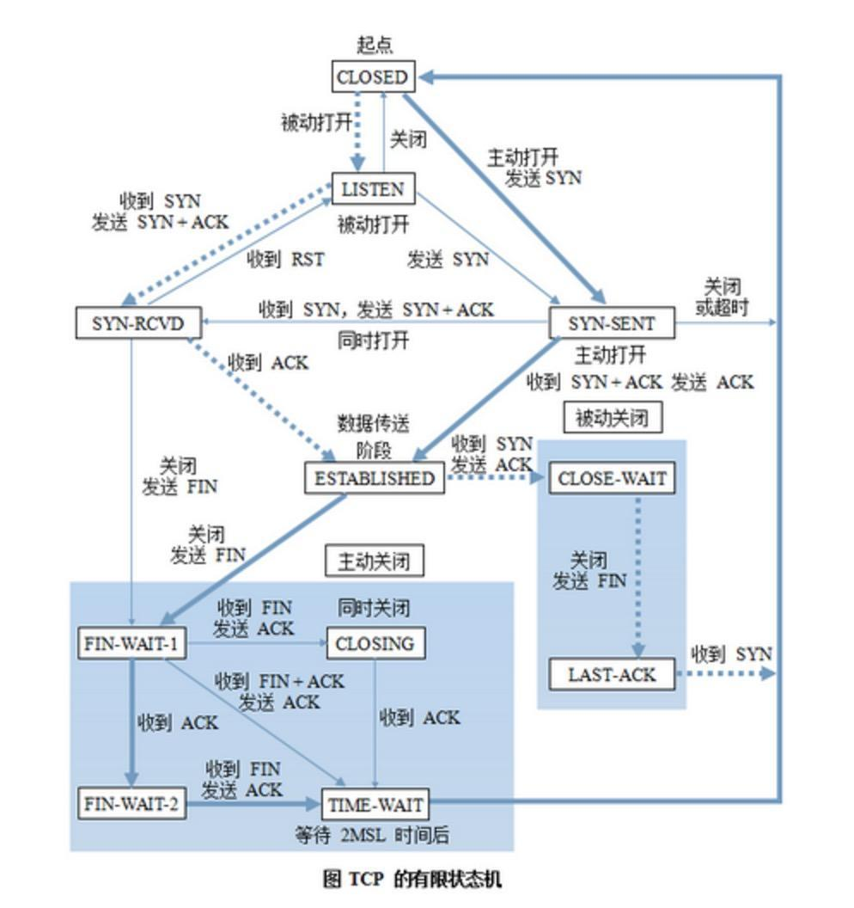

### 论学好正则的必要性——初始状态机

2019/03/03

这件事情源于codewar的一道算法题：  
 
#### [Molecule To Atoms](https://www.codewars.com/kata/molecule-to-atoms)：  

>
>For a given chemical formula represented by a string, count the number of atoms of each element contained in the molecule and return an object (associative array in PHP, Dictionary<string, int> in C#, Map in Java).  
>
>For example:  
>
>>String water = "H2O";  
parseMolecule.getAtoms(water); // return [H: 2, O: 1] </br>
>String magnesiumHydroxide = "Mg(OH)2";   
parseMolecule.getAtoms(magnesiumHydroxide); // return ["Mg": 1, "O": 2, "H": 2]</br>
String fremySalt = "K4[ON(SO3)2]2";  
parseMolecule.getAtoms(fremySalt); // return ["K": 4, "O": 14, "N": 2, "S": 4]</br>
parseMolecule.getAtoms("pie"); // throw an IllegalArgumentException  
>
>As you can see, some formulas have brackets in them. The index outside the brackets tells you that you have to multiply count of each atom inside the bracket on this index. For example, in Fe(NO3)2 you have one iron atom, two nitrogen atoms and six oxygen atoms.  
>
>Note that brackets may be round, square or curly and can also be nested. Index after the braces is optional.  


大意就是给你一个化学式，比如H2O，你要计算化学式各个原子的数量，写在一个列表里。  
乍一看其实挺简单，我们只需要一个HashMap的结构，遍历字符串，统计一下各个元素，将元素名作为key，并且将元素后面的数字写入到Value就OK了。  
其实并不是！  
元素本身有两种情况：大写字母，大写字母+小写字母。  
元素后面也可能有化学计量数，也可能没有。   
这个化学计量数可能是一位的，也可能有两位的。 
如果说，读取的字符都不属于上述所有情况，就要报错！  
所以说，我们的程序，读取一位字符并作出相应的动作的时候，必须要考虑到上一个字符输入情况。  
上一个字符的输入情况，我们可以认为是当前程序的状态，我们取名叫“现态”。
>“现态”意思是，现在的状态。  
现在，这一个字符的输入情况，我们可以认为是程序将要变成的状态，我们取名叫“次态”。
>“次态”的意思是条件满足后要迁往的新状态。  
我们假定，当我们的程序读到大写字母的时候，它的状态码是1，读到小写字母的时候，它的状态码是2，读到数字的时候，它的状态码是3。  
我们可以根据程序所有可能的状态，列出所有可能的情况！  
横轴为现态的状态码。  
纵轴为次态的状态码。  
表格的内容表示是否报错，1为输入合法，不报错，0为输入非法，报错；  

|状态码| 1 | 2 | 3 |
|:--:|:-:|:-:|:-:|
|1|1|1|1|
|2|1|0|0|
|3|1|1|1|

当然，仅仅是判断输入的合法性是不够的，我们在获取到某一输入，也就是满足一定“条件”之后，我们的程序也需要作出相应的“动作”  
>在这里，我们的“条件”是：迁往的新状态需要满足的条件。“次态”是相对于“现态”而言的，“次态”一旦被激活，就转变成新的“现态”了。  
“动作”是：条件满足后执行的动作。动作执行完毕后，可以迁移到新的状态，也可以仍旧保持原状态。动作不是必需的，当条件满足后，也可以不执行任何动作，直接迁移到新状态。  

下面，我们将扩充上面的状态表，将用到以下变量  
atomStr：原子字符串，用于暂存上一个元素符号的输入。  
numStr：数字字符串，用于暂存上一个数字的输入。  
Map：HashMap<String,int>，我们存储数据的表。拥有方法：写入——写入atomStr变量（Key）和转化为int的numStr（Value），若numStr为空则写入1。在写入表之前，我们需要判断表中是否存在我们将要写入的原子字符串，如果存在，我们将在原有的value的基础上加上本次写入的数据；如果不存在，就直接写入。  

|状态码| 1 | 2 | 3 |
|:--:|:-:|:-:|:-:|
|1|之前的字符串写入Map，刷新两个字符串，并将当前字符存于atomStr</br>(此时numStr为空)|之前的字符串写入Map，刷新两个字符串，并将当前字符存于atomStr</br>(此时numStr为空)|之前的字符串写入Map，刷新两个字符串，并将当前字符存于atomStr</br>(此时numStr不为空)|
|2|将当前字符存于atomStr|报错|报错|
|3|将当前字符存于numStr|将当前字符存于numStr|将当前字符存于numStr|

最后，当字符串完成遍历的时候，我们得到的Map，也就是我们现在所需要结构  
考虑到上述这几种情况的时候，我们才能处理C10H22和CH3COONa这样简单的情况。  

如果要处理“K4[ON(SO3)2]2”，状态码就会变成5个（多出来的分别是左右括号），输出情况就会陡增为25种！   
另外，为了适应括号后可能存在的系数，你还需要维护一个栈，栈中有多个Map，将所有括号未闭合Map分别入栈，待读到相应的右括号（你需要检查括号的合法性（] 是非法的！）和后面的数字的时候再将该Map与上一个Map合并。    
最后，读完字符串后，栈内最后一个Map就是所需要的表。   

当然，这种方法是一个比较蠢。如果你熟悉编译原理，你就会知道，这玩意其实就是一个状态机！   

下面简述一下状态机的基本概念：  
> 状态机的基本定义：状态机是一种具有指定数目的状态的概念机，它在某个指定的时刻仅处于一个状态。状态的改变是由输入事引起的状态变化。作为对输入事件的响应，系统可能转变到相同或不同的状态，而输出事件可能是任意产生的。    

这玩意的用途很广，可以用作自然语言的处理，软件工程，编译器和网络协议。  

没错！这张描述TCP状态的图，就是一个有限状态机。  
然后他有四个要素：现态、条件、动作、次态。概念在上面已经解释过了，在这里就不再赘述。   

当然，读到这里（也许还没有读到这里），你也许会问，这和正则有什么关系。  
其实，正则表达式本质上就是一个“非确定有限状态自动机”！  

在这里，你可以使用正则表达式，或者是字符串查找快速匹配你所需要的字符串，然后执行写入。基本上可以大幅度简化我之前的算法…… 所以说，不会用正则，编程两行泪。  

最后贴上代码  
```Java
import java.util.Map;
import java.util.HashMap;
import java.util.*;
import java.lang.IllegalArgumentException;


public class ParseMolecule {

    public static Map<String,Integer> getAtoms(String formula) {
        try {
            GetAtoms getAtoms = new GetAtoms();
            return getAtoms.getAtoms(formula);
        }
        catch (Throwable throwable){
            throw new IllegalArgumentException();
        }

    }

}
class GetAtoms{

    private int status=0;

    private String str = "";
    private String numstr = "";

    private static Throwable IllegalArgumentException;

    public  Map<String,Integer> getAtoms(String formula) throws Throwable {
        char a;

        LevelStack levelStack = new LevelStack();
        for(int i=0;i<formula.length();i++){
            a = formula.charAt(i);
            if(a<='Z'&&a>='A'){
                str = getUpWord(a,str,levelStack);
            }else if(a<='z'&&a>='a'){
                str = getLowWord(a,str,levelStack);
            }else if(a<='9'&&a>='0'){
                numstr = getNum(a,str,levelStack);
            }else if(a=='['||a=='('||a==']'||a==')'||a=='{'||a=='}'){
                getBrackets(a,str,levelStack);
            }else {
                throw new IllegalArgumentException();
            }
        }
        handle(str,levelStack);
        return levelStack.popLastMap();
    }

    public String getUpWord(char a,String str,LevelStack levelStack) throws Throwable {
        int i = 1;
        if(numstr!="") {
            i = Integer.parseInt(numstr);
        }
        if(status==0 ||  status==4 ){
        }else if (status==1 || status ==2){
            levelStack.add(str,1);
        }else if(status==3){
            levelStack.add(str,i);
            numstr="";
        }else if(status==5){
            levelStack.popStack(i);
            numstr="";
        }
        str = String.valueOf(a);
        status = 1;
        return str;
    }

    public String getLowWord(char a,String str,LevelStack levelStack) throws Throwable {

        if(status == 1){
            str+=String.valueOf(a);
        }else {
            throw new IllegalArgumentException();
        }
        status = 2;
        return str;
    }

    public String getNum (char a ,String str ,LevelStack levelStack )throws Throwable{
        numstr += String.valueOf(a);
        if(status ==1 || status ==2 || status ==3){
            status=3;
        }else if(status == 5){
        }else{
            throw new IllegalArgumentException();
        }

        return numstr;
    }
    public void  getBrackets(char a ,String str,LevelStack levelStack)throws Throwable{

        handle(str,levelStack);

        if(a=='['||a=='('||a=='{'){
            levelStack.addStack(a);
            status=4;
        }
        else if(a==']'||a==')'||a=='}'){
            levelStack.isBracketsMatch(a);
            status=5;
        }
    }
    public void handle(String str,LevelStack levelStack)throws Throwable{
        int i = 1;
        if(numstr!="") {
            i = Integer.parseInt(numstr);
        }
        if(status==1||status==2||status==3){
            levelStack.add(str,i);
            numstr="";
        }if(status==5){
            levelStack.popStack(i);
            numstr="";
        }
    }

}


class Maps{

    private Map<String,Integer> map;

    private int level=0 ;

    private int levelnum = 0;

    private static int SIZE = 10;

    private char brackets;

    Maps(char a,int level ){
        map = new HashMap<>();
        brackets = a;
        this.level = level;
    }

    public void decreaselevel(int count){
        this.levelnum=count;
    }

    public int increaselevel(){
        return level+1;
    }

    public Map<String, Integer> getMap() {
        return map;
    }

    public int getLevel() {
        return level;
    }

    public int getLevelnum() {
        return levelnum;
    }


    public char getBrackets() {
        return brackets;
    }

}

class LevelStack{
    private Stack<Maps> stack =new Stack();

    private Maps maps;
    private Throwable IllegalArgumentException;

    LevelStack(){
        Maps maps =new Maps('(',0);
        this.maps=maps;
        stack.push(maps);
    }

    public Maps popStack(int count) throws Throwable {
        this.maps = stack.pop();
        if(stack.capacity()==0){
            throw new IllegalArgumentException();
        }
        Maps mapsAfter = stack.peek();
        maps.decreaselevel(count);
        int num = 0;
        for(Map.Entry<String,Integer> entry :maps.getMap().entrySet()){
            String atom = entry.getKey();
            num = entry.getValue() * maps.getLevelnum();
            if(mapsAfter.getMap().containsKey(atom)){
                num += mapsAfter.getMap().get(atom);
            }
            mapsAfter.getMap().put(atom,num);
        }
        this.maps=mapsAfter;
        return maps;

    }

    public Map popLastMap() throws Throwable {
        if(stack.peek().getLevel()==0){
            return stack.pop().getMap();
        }else {
            throw new IllegalArgumentException();
        }
    }

    public Maps addStack(char a){
        maps = stack.peek();
        maps = new Maps(a,maps.increaselevel());
        stack.push(maps);
        return maps;
    }

    public void add(String str,int i){
        if(maps.getMap().containsKey(str)){
            maps.getMap().put(str,maps.getMap().get(str)+i);
        }else {
            maps.getMap().put(str,i);
        }
    }

    public void isBracketsMatch(char a) throws Throwable{
        a =(char)(a-1);
        if(a == maps.getBrackets() || (char)(a-1) == maps.getBrackets()){
        }else {
            throw new IllegalArgumentException();
        }
    }
}


```